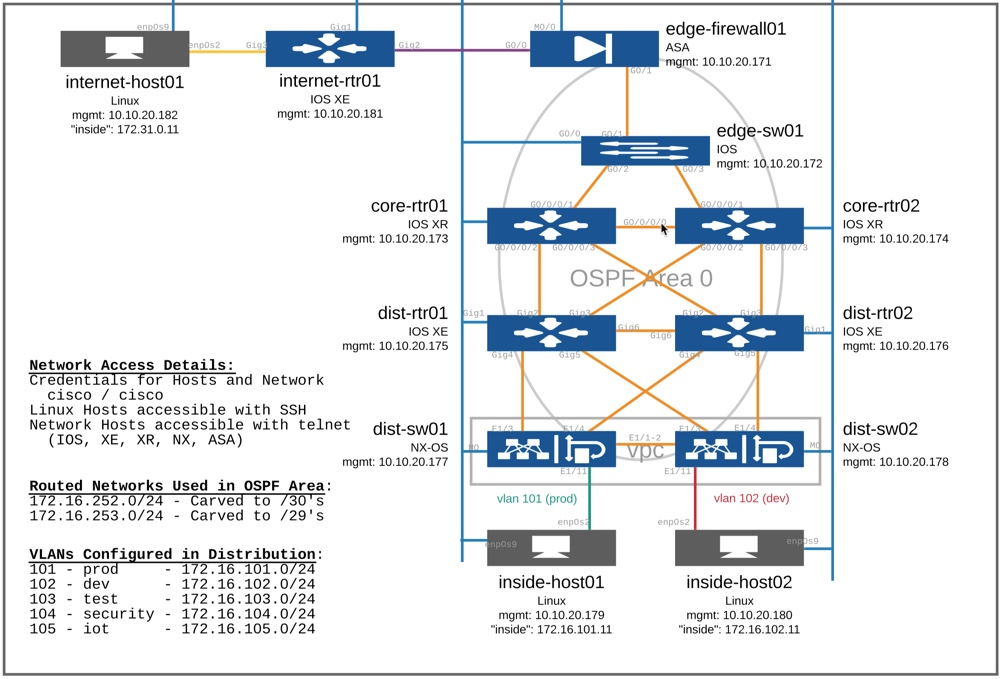

# intro-network-tests
Demos, examples, content for the talk "Introduction to Writing Network Tests with pyATS"

## Resources 

* [pyATS Homepage](https://developer.cisco.com/pyats/)
* [pyATS Getting Started Guide](https://pubhub.devnetcloud.com/media/pyats-getting-started/docs/index.html#)
* [pyATS on GitHub](https://github.com/ciscoTestAutomation)
* [pyATS on PyPi](https://pypi.org/project/pyats/)
* [pyATS on Docker Hub](https://hub.docker.com/r/ciscotestautomation/pyats/)
* [pyATS Supported Devices](https://pubhub.devnetcloud.com/media/unicon/docs/user_guide/supported_platforms.html)
* [pyATS Library Supported Parsers](https://pubhub.devnetcloud.com/media/genie-feature-browser/docs/#/parsers)
* [pyATS Library Supported Feature Models](https://pubhub.devnetcloud.com/media/genie-feature-browser/docs/#/models)
* [pyATS Library Supported API Functions](https://pubhub.devnetcloud.com/media/genie-feature-browser/docs/#/apis)
* [pyATS Library Supported Triggers](https://pubhub.devnetcloud.com/media/genie-feature-browser/docs/#/triggers)
* [pyATS Library Supported Verifications](https://pubhub.devnetcloud.com/media/genie-feature-browser/docs/#/verifications)
* [Genie Harness Getting Started Guide](https://pubhub.devnetcloud.com/media/genie-docs/docs/cookbooks/harness.html)

## Demo Network

If you'd like to run the demo tests in this repository, first step is to reserve the network that goes along with the [`testbed.yaml`](testbed.yaml) file. 

[DevNet Sandbox: Cisco Network Services Orchestrator](https://devnetsandbox.cisco.com/RM/Diagram/Index/43964e62-a13c-4929-bde7-a2f68ad6b27c?diagramType=Topology)



This sandbox provides a sample network configured with interfaces, routing, etc that can be used for a variety of tests and labs.  

## Installing pyATS 

It is recommended to review the [pyATS Getting Started Guide](https://pubhub.devnetcloud.com/media/pyats-getting-started/docs/index.html#), but you can get started quickly with this. 

```
pip install pyats[full]
```

> Note: you'll need to be on Linux or macOS and be in a virtualenv of Python 3.5+ 

## Running the Sample Network Test 

The folder [`network_test_project`](network_test_project) will check that all devices in the testbed are reachable, and that interfaces aren't showing any errors.  

Run the test with

```
pyats run job network_test_project/network_test_job.py --testbed testbed.yaml
```

> Note: you'll need to be VPN connected to the DevNet Sandbox to run the test

